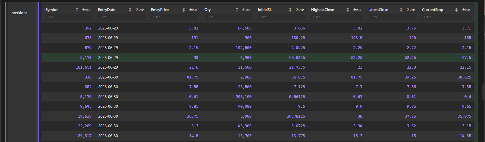

# Obsidian JSON Table Viewer

A premium Obsidian plugin that transforms standard JSON data into beautiful, interactive, and recursively nested tables. It works both inside note code blocks and as a direct file viewer for `.json` files in your vault.

 

## Features

- **Recursive Table Rendering**: Automatically converts nested objects and arrays into vertically or horizontally nested tables, with visual left-border indicators to display nesting depth.
- **Interactive Headers**:
  - **Sorting**: Click any column title or arrow indicator to cycle through Ascending (`▲`) -> Descending (`▼`) -> Unsorted (`↕`).
  - **Filtering**: Type in the `Filter...` input box below headers to filter matching rows instantly.
  - **Grouping**: Group rows dynamically by any column values. Group headers are collapsible and show item counts (e.g., `📁 exchange: IB_US (2 items)`).
  - Each nested table maintains its own independent sort, filter, and group states.
- **Direct `.json` Viewer**: Registers the `.json` file extension so that clicking any JSON file inside Obsidian's file explorer opens it directly as an interactive, structured table.
- **Live Reloading**: Listens to vault file modifications and automatically re-renders note tables when the referenced JSON file changes.
- **Smooth Sticky Scrolling**:
  - **Sticky Headers**: Column headers stay locked at the top of the viewport when scrolling down tall tables.
  - **Sticky Property Keys**: Property keys in vertical tables (such as `compilerOptions` or `position`) align to the top and scroll dynamically with the viewport inside their row container.
- **Rich Visuals & Highlights**:
  - **Zebra Striping**: Alternating row backgrounds using Obsidian's native `var(--background-secondary-alt)` variable.
  - **Yellow Hover Highlights**: Premium soft yellow/gold highlight on hover.
  - **Row Selection**: Click anywhere on a row (excluding inputs, buttons, and links) to toggle a soft green highlight selection.
  - Formatted numbers, clickable URL links, and colored badges for booleans.

---

## Installation

### Manual Installation
1. Download `main.js`, `manifest.json`, and `styles.css` from the latest release.
2. In your vault, navigate to `.obsidian/plugins/` and create a folder named `obsidian-plugins-json-table-viewer`.
3. Paste the three downloaded files into that folder.
4. Open Obsidian, go to **Settings** -> **Community Plugins**, reload the list, and toggle on **JSON Table Viewer**.

---

## Usage

### 1. Direct JSON Codeblocks
You can write raw JSON directly inside a `json-table` codeblock:

```json-table
{
  "portfolioName": "Growth Fund",
  "active": true,
  "holdings": [
    { "symbol": "AAPL", "shares": 50, "price": 172.5 },
    { "symbol": "MSFT", "shares": 25, "price": 420.2 }
  ]
}
```

### 2. Referencing JSON Files in your Vault
You can display tables by referencing `.json` files stored in your vault:

```json-table
path: data/portfolio.json
```
*(Or simply write `data/portfolio.json` or `file: portfolio.json`)*

---

## License

This plugin is licensed under the [MIT License](LICENSE).
